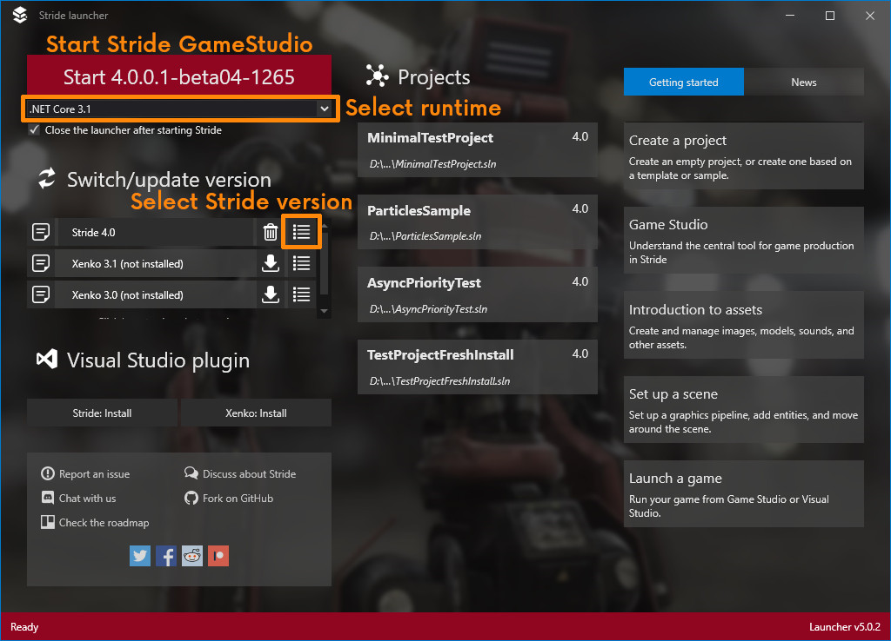
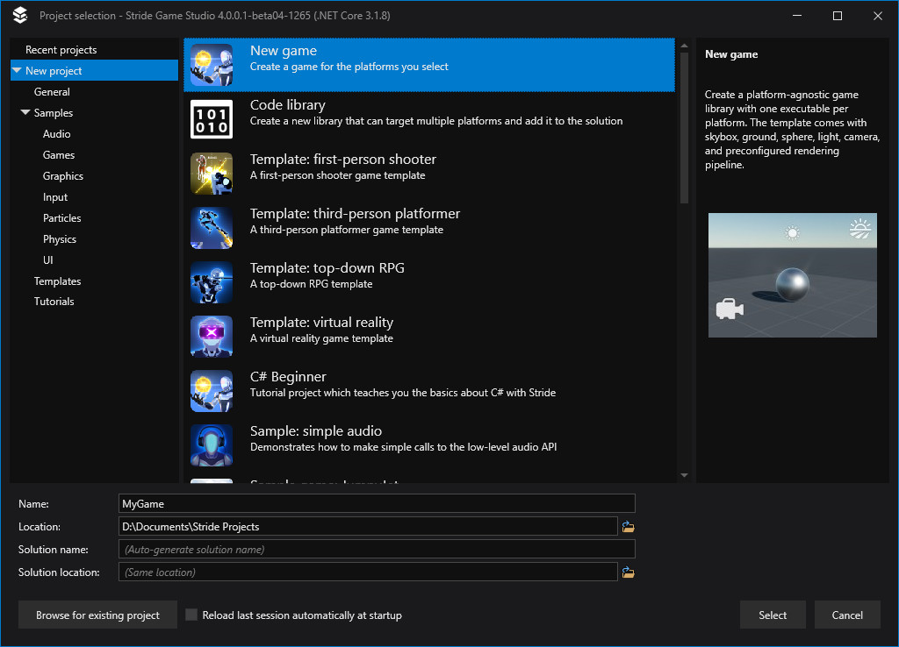
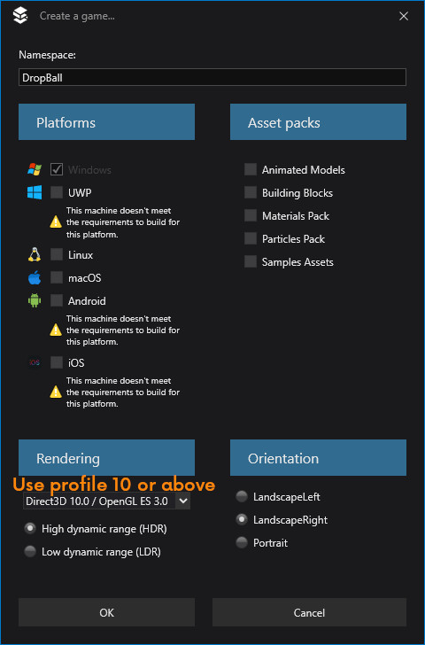
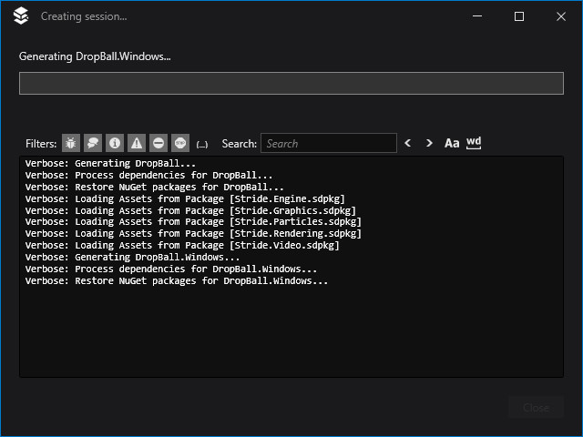
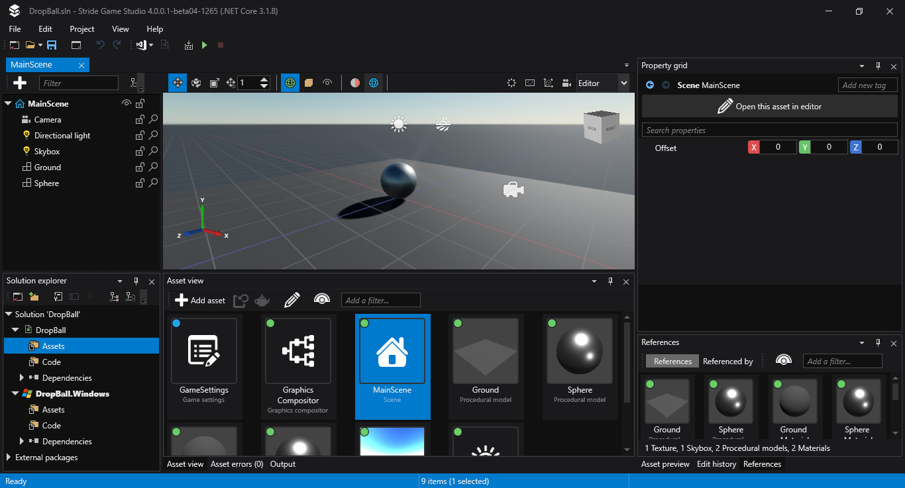

# Lesson 1: Create a new project in Stride
## Install Stride
Before we start working with Stride make sure you have it installed. Go to [stride3d.net](https://stride3d.net/) and follow the instructions to download and install Stride Launcher. If you have trouble you can look through this [video](https://www.youtube.com/watch?v=SX5gLobqf6M) where I installed Stride onto a clean Windows 10 machine.

After you install Stride you should be able to open the Launcher. On the image below I highlighted the most interesting options:

If you have installed .NET Core 3.1 you may use the .NET Core option in the Stride Launcher. Otherwise you should use the .NET Framework which is preinstalled on your Windows machine. For the purpose of this workshop there is no difference between the versions (except the built-in code editor has no syntax highlighting on .NET Core). .NET Core is the newer runtime and has more features than .NET Framework, which may be worth considering for your project.

Should you have problems with the starting Stride GameStudio:

1. Wait. Sometimes the process is running in the background and may delay showing you an error message.
2. If you've waited over 2 minutes and nothing is happening - remove the installed GameStudio version (trash bin icon) and reinstall it.
3. If that didn't help, check the other runtime. If neither runtime is showing anything, contact me.
4. If it's opening but there's an error, check the error message - if it's about missing dependencies, install them. If it's about NuGet packages, contact me so that we can troubleshoot.

## Create a new project
Once you started the GameStudio you should see the following:

At the bottom you can choose the name of your project and directory where to create it. You have a few options to initialize it:

* **New game** - Creates a new solution with a library project for your game logic and one executable project per platform. It contains a plane, a sphere, a skybox, a camera and preconfigured graphics compositor. You will usually start with this template.
* **Code library** - Creates a single library project with dependencies on Stride packages and no assets.
* **Templates** - Creates a base project of chosen type to build upon.
* **Samples** - Creates a small project that showcases a particular feature of Stride.
* **Tutorials** - Creates a project for the [C# Beginner tutorial](https://doc.stride3d.net/latest/en/tutorials/csharpbeginner/index.html).

Let's create a new game and call it "DropBall". Next you'll see a window with additional options where you can change the default namespace, targeted platforms, graphics profile, etc. Those settings can be changed after the project has been created as well.

Click "OK" and the project will be created. Next the project will get loaded and for a moment you'll see the loading dialog:

Finally the Stride GameStudio will appear and load your project showing you the following:

## Project structure
Let's look into the created folder:

* `DropBall/` - folder root
    * `DropBall.sln` - Visual Studio solution file for the library and executable projects - this is what Stride asks for when loading a project
    * `.gitignore` - instructions what to ignore for Git version control
    * `DropBall/` - library project folder
        * `Assets` - assets folder - here's the definition of the main scene, game settings and every created asset
        * `Resources` - files from which assets are created (e.g. skybox texture for skybox asset)
        * `DropBall.csproj` - C# project file used to compile code
        * `DropBall.sdpkg` - Stride specific project settings
        * `BasicCameraController.cs` - C# script for controlling the camera in the game
    * `DropBall.Windows` - Windows executable project folder
        * `Resources` - Windows specific resources (here icon for the EXE file)
        * `DropBallApp.cs` - entry point to the application
        * `DropBall.Windows.csproj` - C# project file used to compile code
        * `DropBall.Windows.sdpkg` - Stride specific project settings
