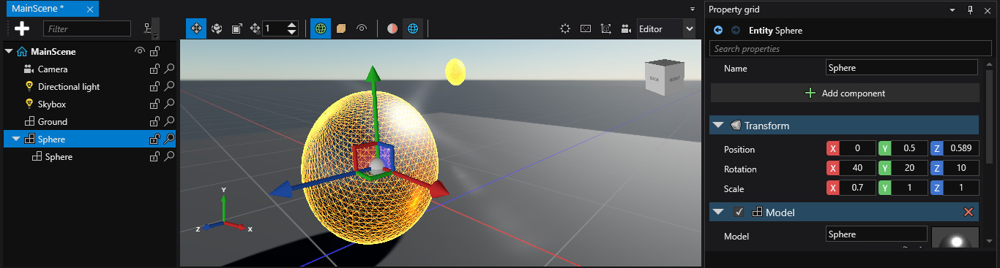

# Lesson 2: Learn about entity hierarchy and the transform component
## Entities-Components-Systems architecture

**Basics**: the world of your game is divided into scenes. Each scene can host multiple entities. Each entity has some components that describe its looks and behaviors. Entities can also have children - other entities whose position is relative to their parent. When the game is executed on each frame it goes through every system and updates it. The physics system processes all entities with a physics component. The rendering system draws all entities with a model component.

In traditional object oriented programming entities are described by their classes (code). In ECS entities are described by data which gives the ability to create them to designers, who aren't necessary coders.

## Create a child entity
Let's test how the hierarchy works by adding a child entity to the sphere entity. In the lower middle you should see the 'Asset view' which shows all the assets in your project. Drag the sphere asset onto the sphere entity. You should see another sphere under the first one in the entity tree.

We don't see it in the game view yet, because those spheres are in the exact same place. Select this child sphere. You will now see a 3D gizmo (arrows) in the game view which allows you to move the child sphere around. On the right you can see the property grid which displays all the components of the selected entity. You can move the sphere by changing the value of the Position vector on the Transform component.

Let's make the child sphere smaller, by changing its scale to {X: 0.2, Y: 0.2, Z: 0.2}. Now let's select the parent sphere and apply transform changes to it. You can see that the child is also affected.

## Clean up
Let's reset the transform values (0 for position and rotation, 1 for scale) and remove the child entity.
