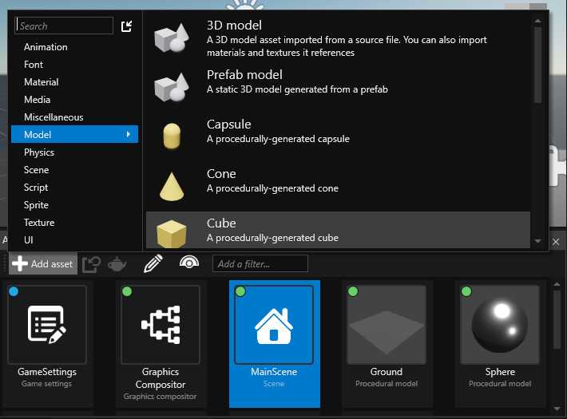
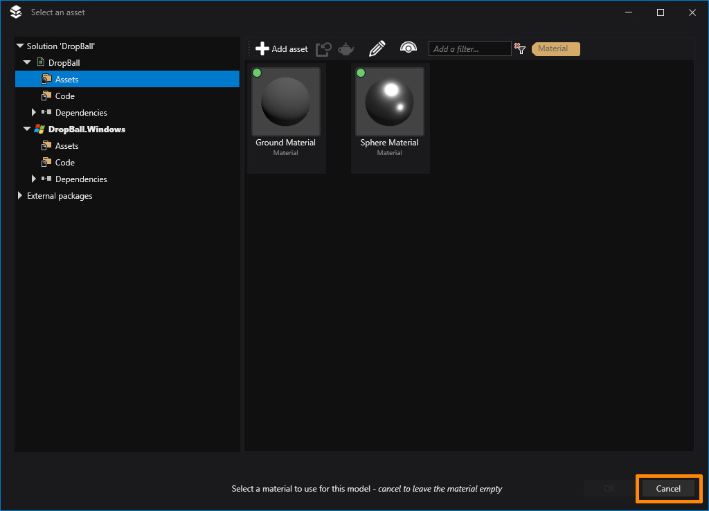
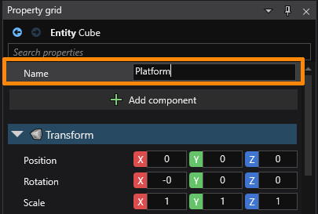
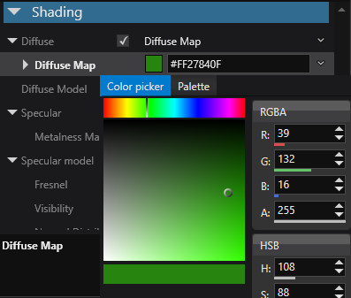
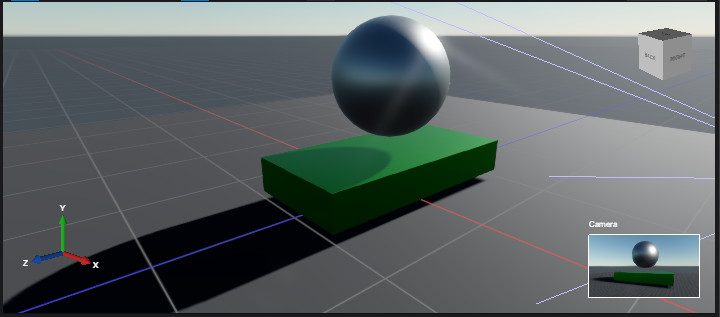

# Lesson 3: Create a new cube asset and create our platform entity

## Adding assets
Everything used in your game, from scenes, through models and textures, to code is an asset. You can view assets in the 'Asset view' window and 'Solution explorer'. You can add assets from either the 'Asset view' window, from the 'Project' menu or by pressing `Ctrl+I`.

Let's add a cube asset. We'll see a window asking us to select a material. For now let's click cancel and later we'll create a new material for the platform.

You can now see the cube in the 'Asset view'. But it's not saved yet, it only exists in memory. Let's press `Ctrl+S` and have it actually created.

Now, we can drag this cube onto our entity hierarchy. It will create a new entity called 'Cube' with a model component. The cube has no material assigned and is therefore white. Because this is going to be our platform, let's rename the entity to 'Platform'. To do that we can either right click on the entity in the hierarchy and choose 'Rename', press F2, or change it at the top of the property grid.

Let's create the material for our platform. It can be similar to the sphere, but perhaps of a different color. Find the 'Sphere Material' in the asset view, right click on it and choose 'Create derived asset' at the top. You will now see a copy called 'Sphere Material-Derived'. It also is only in memory for now and waits to be saved. First let's rename it to 'Platform Material'. Next go to the properties, find the 'Diffuse map' and change the color to dark green. To open the color picker, click on the square next to the color definition in hexadecimal.

Because we have created a derived asset, any changes made to the 'Sphere Material' will also be applied to the 'Platform Material', except for what has been overridden - which in this case is the diffuse map color.

Now let's save the material and apply it to the platform. Select the platform entity and expand it's Model component. In the Material field click the hand icon to pick a material. From the 'Select asset window' choose the 'Platform Material' and click 'OK'. Now the cube has turned green.

Finally, transform the cube into an actual platform and position the sphere above it.

## Building the game
Now let's test our game by building and running it. Press F5, the green triangle in the top toolbox or go to the Project menu. In the same window as 'Asset view' there's a tab called 'Output' where you can see the logs from building your project.

> In the current version of Stride (beta04-1265) there's a bug that gives an error during Game Studio build when you have a derived material (see [stride/#280](https://github.com/stride3d/stride/issues/280)). You can still run and build your project from the command line or Visual Studio. To temporarily fix the build in the Game Studio, edit the material asset file `Platform Material.sdmat` and remove the line which mentions an archetype.
