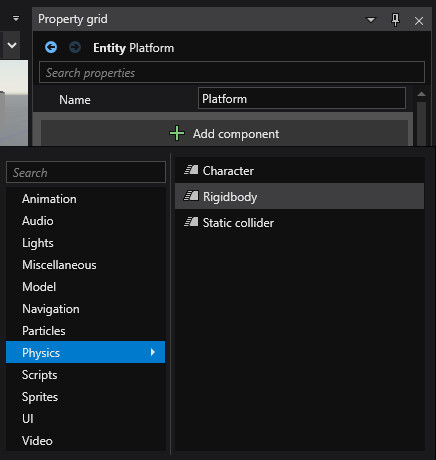
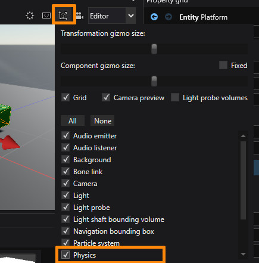
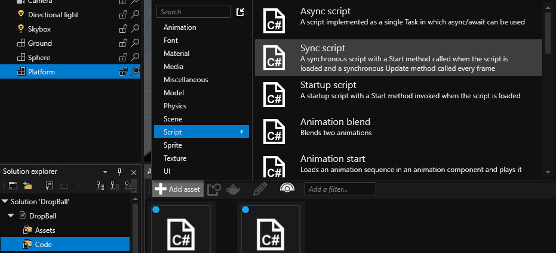

# Lesson 4: Create a script the moves the platform

## Introducing behaviors
In order for entities to change over time there has to be some code written which updates their state. You can create advanced systems that react to special kinds of components, like for example entities with a physics component are updated by the physics system. Or you can create a script component that is executed just for the entity that holds it.

In this lesson we'll make both our sphere and the platform subject to physics. Then we'll create a script which makes the platform go upwards.

## Rigidbody
Let's add a Rigidbody component to the platform. With the entity selected, go to the property grid, click the 'Add component' button and select Physics > Rigidbody.

Next, in order for the physics component to work, we need to add a collider shape. Expand the Rigidbody component, scroll down to the 'Collider Shapes' collection and add a new box collider. The default value is fine, because both the collider and the model are cubes, stretched by the transform. To see the collider shape you need to enable physics in the viewport options.

When you launch the game you will see the platform fall down. Now do the same to the sphere (but use a sphere collider with radius of 0.5).

## Constant Velocity Script
Now that our entities are falling down, let's get the platform moving up. Find the code folder in the solution explorer and add a sync script. Call it `ConstantVelocity` and click Create.

You may need to save the project like with other assets. Double click on the script to open it in the build-in editor. You can also use the 'Open in IDE' button from Project menu, or toolbar to launch Visual Studio.

Add the following to the script:

    using Stride.Core.Mathematics;
    using Stride.Engine;
    using Stride.Physics;

    namespace DropBall
    {
        public class ConstantVelocity : SyncScript
        {
            public float Velocity { get; set; }

            public override void Update()
            {
                Entity.Get<RigidbodyComponent>().LinearVelocity = new Vector3(0, Velocity, 0);
            }
        }
    }

The public property `Velocity` will be exposed in the editor when you add the script to the platform entity. Set it to something like 0.5 to see the platform move slowly upwards. This script set the velocity on each frame to the value of the property. If it wasn't set on each frame, the platform would loose it's velocity due to gravity.

Every script has a `Entity` property, which is the entity it has been set on. Every entity has a `Get` method that allows to browse its components by type. Here we're looking for the physics component so that we can set its property - the `LinearVelocity`.

> Note that in Stride Y is the up axis.

