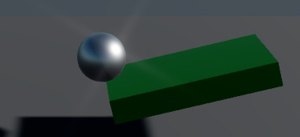

# Lesson 5: Create a script that processes user input and moves the sphere

## Game loop
While the game is running it works by doing a simple loop - check input, update systems, draw. One step of that loop is a frame. The shorter the processing time, the more frames per second the game can compute. Your screen is likely to have a refresh rate of 60Hz. The smallest framerate used in cinematography is 24 fps.

When we created the script in the previous lesson, each frame it was setting the velocity of the platform to a provided value. By default Stride uses V-Sync a system that limit the framerate to the refresh rate of your screen. It's possible to do more frames a second, but usually it doesn't make sense, because you would render more frames than your screen can show.

## User input
Stride allows to get a few different input from the user: keyboard, mouse, gamepad or touch screen. For this workshop we will only use the keyboard.

We want to make the Sphere move left and right so that it can fall off the platform. To do that we'll create a sync script, that on each frame checks if the right or left arrow key is down and if so sets the velocity on the Z axis.

First, let's move the camera a bit further to cover more space (Position: (8,4,0), Rotation: (-10, 90, 0)) and make the sphere a little smaller (Scale: 0.6). Next add the script 'SphereMovement':

    using Stride.Core.Mathematics;
    using Stride.Input;
    using Stride.Engine;
    using Stride.Physics;

    namespace DropBall
    {
        public class SphereMovement : SyncScript
        {
            public float Velocity { get; set; }
            
            private RigidbodyComponent physics;
            
            public override void Start()
            {
                physics = Entity.Get<RigidbodyComponent>();
            }

            public override void Update()
            {
                var effectiveVelocity = 0.0f;
                
                if (Input.IsKeyDown(Keys.Left))
                    effectiveVelocity += Velocity;
                if (Input.IsKeyDown(Keys.Right))
                    effectiveVelocity -= Velocity;
                
                physics.LinearVelocity = new Vector3(0, 0, effectiveVelocity);
            }
        }
    }

When the component is created we will initialize a private reference to its physics component. That is because with `Entity.Get<T>()` may be slow and doing it every frame is not great. On every frame we will check the input and set the sphere's velocity. If there was no input, or if both arrows are pressed at the same time, the ball will not move.

We can set the Velocity here to something like 5. Now run the game and see what happens.

The platform is tilting and then rotating. That's because the ball's mass affected the platform's rigidbody behavior. To remove that we will have to make the platform a _kinematic_ body. This means it will no longer be moved by the physics engine, but rather we have to move it ourselves.

Select the platform entity and set the 'Is Kinematic' property on its rigidbody component to true. Next, modify the `ConstantVelocity` script:

        public override void Update()
        {
            var currentY = Entity.Transform.Position.Y;
            var newY = currentY + Velocity * (float)Game.UpdateTime.Elapsed.TotalSeconds;
            Entity.Transform.Position.Y = newY;
        }

We change the position of the platform on the Y axis by adding the distance it has moved by since the last update.

Now we see the expected behavior, but when the ball falls off of the platform it's super slow. We will override its gravity to -150 and to compensate for the downward force, we will set the mass of the platform to a 100.

You may have noticed that the camera is moving with the ball. This is because it has a `BasicCameraController` that also listens to keyboard events. Go ahead and remove it form the camera entity.