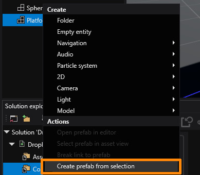

# Lesson 6: Create a prefab out of the platform

## Prefabs
Prefabs are similar to derived assets, but describe entities. A prefab is constructed like a scene. Then it can be instantiated into the scene, either via code or in the editor. An entity created in the editor from a prefab gets updated when the prefab changes, but can also override some properties.

Let's change our platform into a prefab. Select the platform entity, right click and select create prefab from selection.

This will substitute the entity in the hierarchy for the instance of the newly created prefab, which will be highlighted in the asset view.

Let's double click on the prefab to open it and change the `Velocity` to 1. You can see that in the main scene the platform was updated.

In the next lesson we'll use that prefab to create entities from a script.
