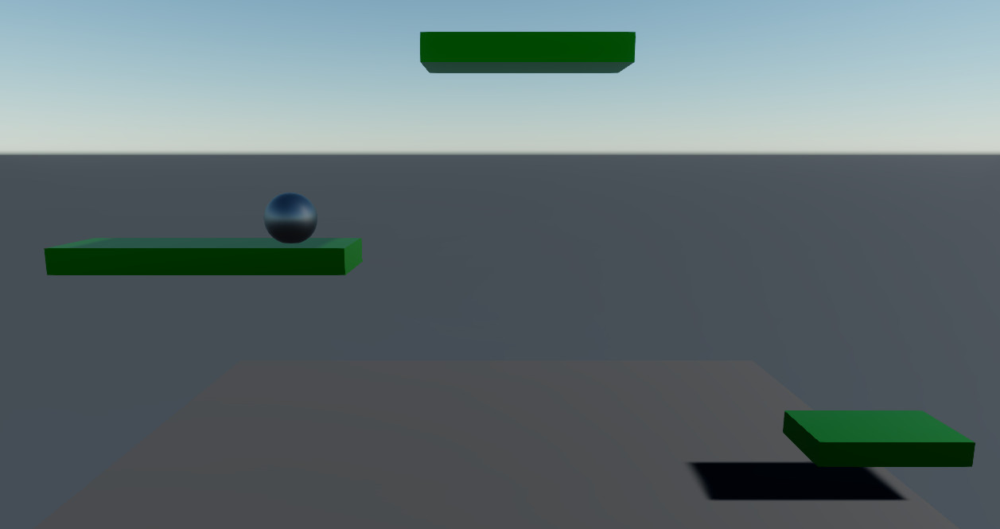

# Lesson 7: Create a platform spawner

## Collision events
The physics system tracks the positions of rigidbodies and their collider shapes. Whenever two physical entities touch, a collision event is raised. To listen for such event we will be using an asynchronous script.

Let's create a spawner entity with a rigidbody with a thin box collider, without a model, and place it just below the plane (Pos.Y: -0.25, Scale: (1, 0.5, 30)). Also, set 'Is Trigger' and 'Is Kinematic' so that it's passthrough and cannot be moved.

We also want the spawner to only collide with platforms and not with the sphere. Let's change the collision groups of those entities. Make Sphere KinematicFilter, Platform StaticFilter, Spawner SensorTrigger. Then change the 'Collides with..' property on the spawner to StaticFilter.

Move the platform down so that it begins in a collision state with the spawner.

Next let's create the async script called `PlatformSpawner`:

    using System;
    using System.Threading.Tasks;
    using Stride.Core.Mathematics;
    using Stride.Engine;
    using Stride.Physics;

    namespace DropBall
    {
        public class PlatformSpawner : AsyncScript
        {
            public Prefab PlatformPrefab { get; set; }

            public float PlatformDistance { get; set; } = 2;
        
            public override async Task Execute()
            {
                var physics = Entity.Get<RigidbodyComponent>();
                while(Game.IsRunning)
                {
                    await physics.CollisionEnded();
                    
                    var entity = PlatformPrefab.Instantiate()[0];
                    entity.Transform.Position = new Vector3(0, -PlatformDistance, 0);
                    
                    Entity.Scene.Entities.Add(entity);
                }
            }
        }
    }

Here in a loop we wait until some collision ends and then create a new instance of a platform at a certain position.

A prefab can hold more than one entity, so we pick the first one (index 0). We set the position to the new entity and then add it to the scene of the Spawner entity. If we don't add the entity to the scene it will not be updated, or displayed.

Add the script to the Spawner component and set the prefab property to the platform prefab.

We can now modify the position assignment to be more random, same with platform length:

    private readonly Random rnd = new Random();
    private void RandomPlatform(out float length, out float position)
    {
        length = (float)(rnd.NextDouble() * 2 + 1.5); // between 1.5 and 3.5
        position = (float)(rnd.NextDouble() * 10 - 5); // between -5 and 5
    }

And set the entity's transform:

    RandomPlatform(out var length, out var position);
    entity.Transform.Position = new Vector3(0, -PlatformDistance, position);
    entity.Transform.Scale.Z = length;

And now we have the core gameplay mechanics. We do however, create lots of entities and the more there is the slower our game will be. So in the next lesson we will be destroying them.

