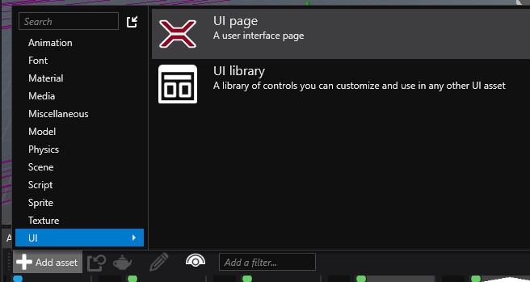
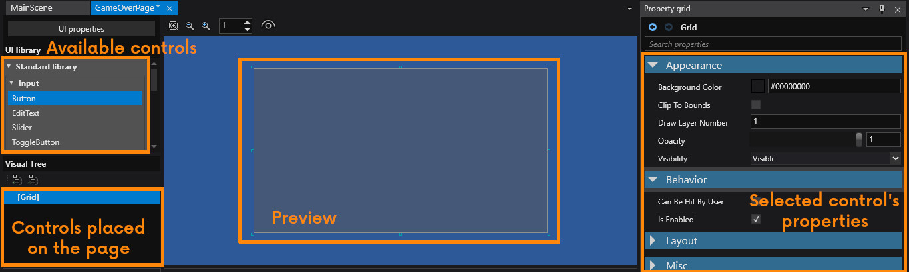
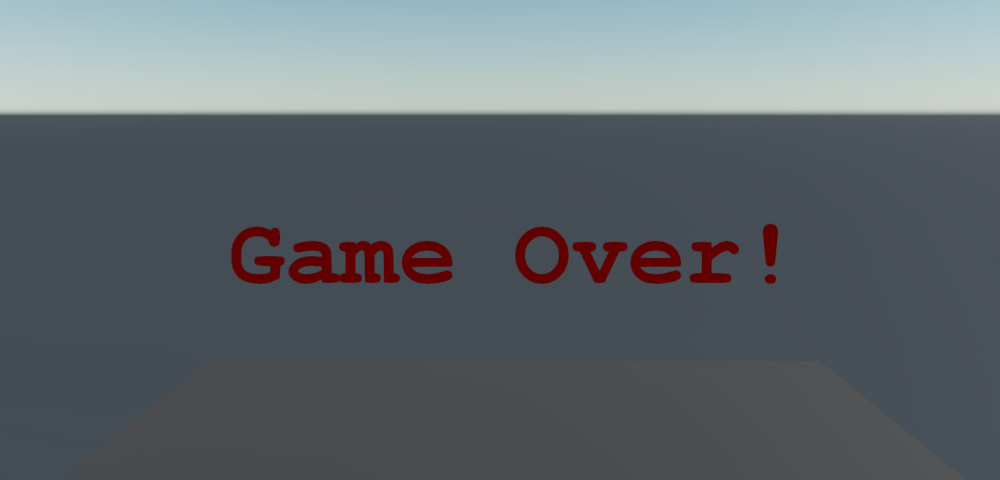

# Lesson 10: Display a text message on game over

## UI system
Stride has a sprite-based UI system with layouting, which allows to easily place UI controls on the screen.

We will create a new UI page that displays big "Game Over!" text in red.

When you open the UI Page asset (which we can call 'GameOverPage') you will see a UI editor.

Let's add a TextBlock to our page by finding it among the available controls and dragging it onto the root Grid control. Select it and write "Game Over!" in its Text property. You'll see a small text in upper left corner of the preview. Let's increase the Text Size to 100. Next, change the vertical and horizontal alignment to center (Layout category). Finally, change the color to dark red and save the page.

Now we will create an entity with a new script that upon receiving the GameOver event will display the UI page.

    using System.Threading.Tasks;
    using Stride.UI;
    using Stride.Engine;
    using Stride.Engine.Events;

    namespace DropBall
    {
        public class GameOverUI : AsyncScript
        {
            public UIPage UIPage;

            public override async Task Execute()
            {
                var receiver = new EventReceiver(SphereKiller.GameOver);
                await receiver.ReceiveAsync();
                
                var ui = Entity.GetOrCreate<UIComponent>();
                ui.Page = UIPage;
            }
        }
    }

Assign the GameOverPage to the `UIPage` property. To display a UI page an entity needs the `UIComponent`. This script uses a `GetOrCreate` method which can create the component if the Entity doesn't have it yet.

